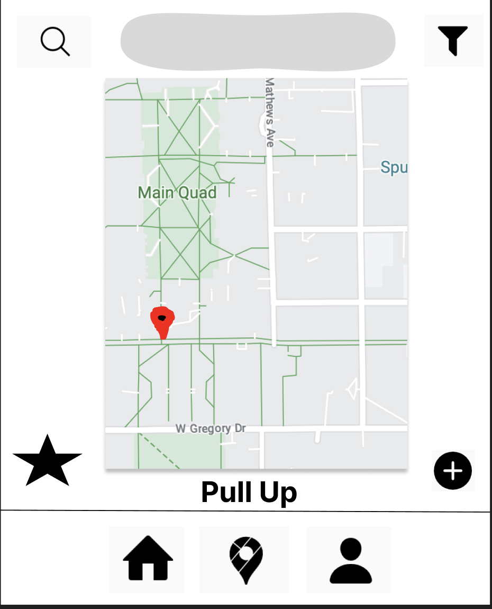

## Project Title
Pull Up

## Project Summary

Project Summary: Pull Up is a web app designed to connect (UIUC) students with fraternity and RSO  events on campus. It fills the gap in the existing UIUC event-tracking landscape because of its emphasis on student-led events. We will manually input initial event data and populate the database with simulated data to create a functional prototype.

## Usefulness

Pull Up is as a valuable tool for the UIUC student community. While there are existing event apps, they mainly focus on university-sponsored events. Pull Up differentiates itself by focusing on student-led events, which are a vibrant and integral part of campus life. This platform encourages collaboration, fosters a sense of community, and helps students make the most of their college experience.

## Realness 

We will initially populate our database with manually inputted event data for fraternity and RSO events like TKE and ACM. To ensure a rich and dynamic user experience, we will also incorporate simulated data generated using random word and number generators. This approach will allow us to create a realistic prototype that showcases the application's capabilities.

## WebApp Description

User Registration: Students can create accounts and set preferences.
Event Creation: Fraternity and RSO members can add details of their events by adding pins on an interactive map.
Event Search: Users can search for events based on criteria like date, location, and organization, or scroll through the map.
User Profiles: Users can create and customize profiles, including location information.
Organization Membership: Users can join and leave organizations, which will affect their event recommendations.
Event RSVP: Users can indicate their attendance at events.
Event Reviews and Ratings: Users can provide feedback and ratings for events they attend.
Notification System: Users receive event recommendations and updates based on their preferences and memberships.
Admin Dashboard: Admins can manage user accounts, content, and system settings.
Triggers: To listen to changes in the database based on certain constraints (who is adding an event, where is the event located, etc.)

## Creative Component

In order to enhance our UI, we aspire to create a Map UI that will enable users to easily find events near them. Ideally, there will be visual annotations on the map for events that they searched for and filtered. 

## DB schema (rough)

## Tables: 
  Organization,
  Event, 
  UserProfile,
  OrgMembers,
  
## Attributes:
 Organization: OrgID (int), Name (char), Location (char), Social Media (char)
 Event: EventID (int), OrgID (int), EventName (char), EventLocation (char)  
 UserProfile: UserName (char), userID (int), Location (char)
 OrgMembers: MemberName (char), userID (int)

# Project Work Distribution:

## Backend Development: Split Equally
  User registration/deletion: Aditya & Daniyal
  Event creation/deletion: Korn & Sankar
  Triggers: Aditya & Daniyal
  Procedures: Korn & Sankar
  Commenting / Likes creation and deletion: Aditya & Daniyal

## Frontend Development: Daniyal & Aditya

## Testing and Documentation: Korn & Sankar

### Each team member will have specific responsibilities within their designated area, such as developing specific features or conducting tests. We will collaborate closely to ensure the successful implementation of Pull Up.

## Visual Mockup

